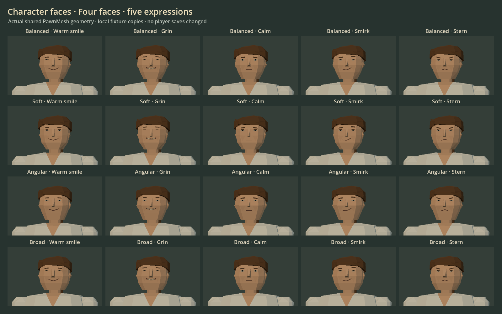
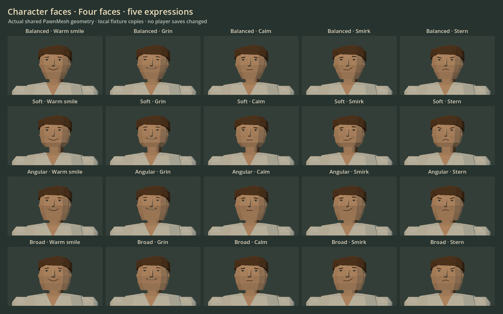
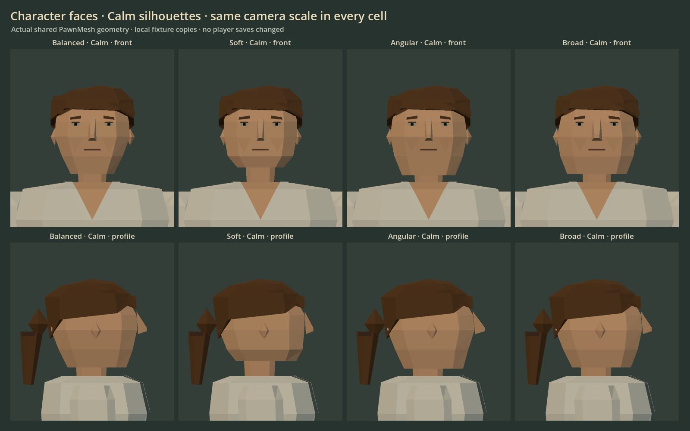

# Character faces — 2026-10-04

Four face shapes (Balanced, Soft, Angular, Broad) and five expressions (Warm
smile, Grin, Calm, Smirk, Stern) share the ordinary keeper and modular crew
renderer. Wider, rising smiles have a flatter centre and more open eyes. The
lower head silhouette distinguishes the shapes without changing hat fit;
covered hair now follows the broad head at the nape.

Before:

After:

`dev/face_smoke.tscn` passes 400 combinations of shapes, expressions, five skin
tones, two builds and bare/worst travel outfits. The largest is 1,396 triangles
against the unchanged 1,400 ceiling. Actual skin cross-sections distinguish
every pair of shapes by at least 8%; the closest pair measures 8.7%.

Windowed checks pass all four creator window shapes, mesh projection, pupils,
normals, private draft cancellation and five screenshot sheets. Character
restart/save checks and wardrobe checks pass. The current three-day house
reconciles all 18 item kinds and gold (4,208g expected and actual).

Expressions need a close view: the small management sample has a 49px body and
12px head. A geometry pass does not prove expression recognition there.
Bespoke legacy armour and robe heads retain their existing renderer.

Import first, then run `Godot_v4.7.2-stable_win64_console.exe --headless --path .
res://dev/face_smoke.tscn`. Run windowed with
`-- capture-prefix=res://.verification/faces_20261004/face` for all five sheets.
