# World visual polish — 2026-10-04

## Bar Table

The former lemonade stall is now a framed timber counter with brass taps,
foot rail, tankard emblem and open bottle shelf. Both sale piles remain at
their existing tile centres and .95 counter height. No catalogue values,
recipes, stock allocation, jobs or serving rules changed.

Before:

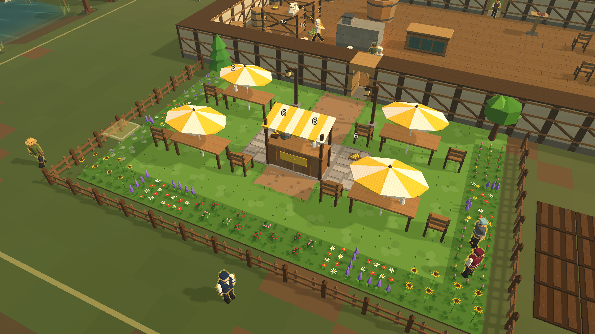

After:

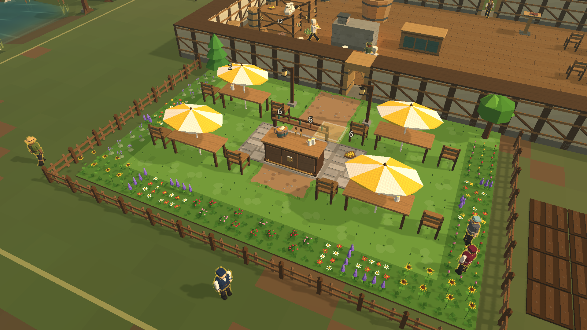

The garden regression group passes: 514 triangles (budget 900), fittings
inside the 2 x 1 footprint, clear drink positions, recipes, porter restocking
and walk-up service. These are the actual windowed garden showcase renders.
All mesh work is original procedural geometry; no third-party assets added.

## Keeper, guests and work — completed 2026-10-05

The keeper has a segmented candle-gold ground ring, independent of their
chosen outfit. Fishing shows a basic rod; staff and keeper share stirring,
pouring and washing poses. Behaviour supplies a read-only presentation request
once per drawn frame. Poses advance with game time, face the work and freeze
when paused. Cancelling fishing hides its rod even while paused.

Walk-up guests display their purchased drink on the return trip. The display
is derived from the saved visit state, survives appearance changes, and clears
at the table. It represents goods already debited at the bar: it never creates
physical cargo, touches stock or charges a second bill.

Exact-overlap bodies now receive distinct stable positions on a small ring.
Only their rendered bodies move, at most .26 tiles; logical positions, routes
and service timing stay unchanged. Dense groups can still overlap. This is
cosmetic separation, not a physical queue or collision system.

Before:

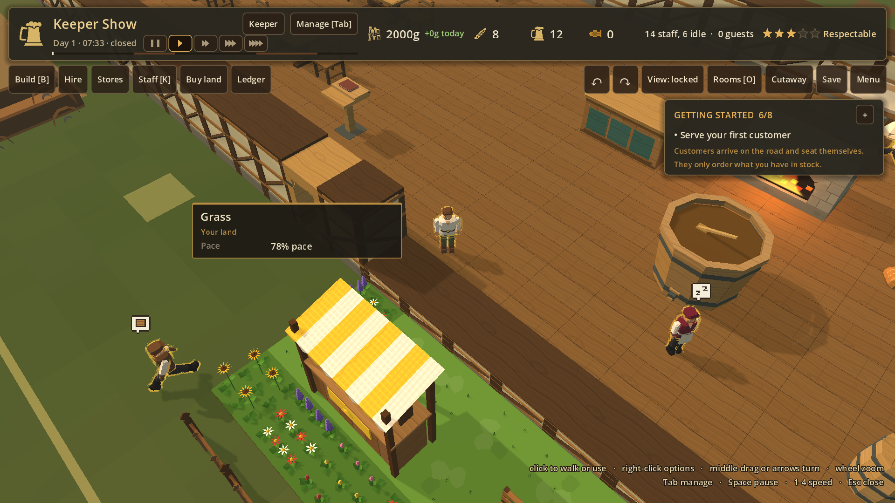

After:

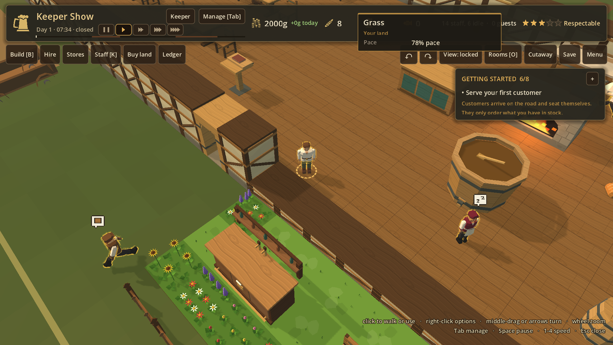

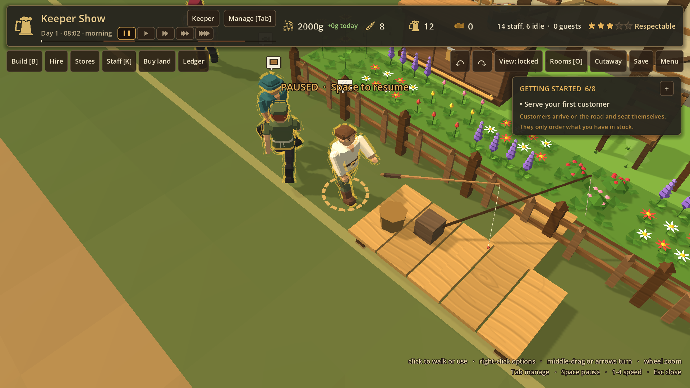

The keeper options menu uses the HUD's timber/candle palette, wrapped action
text, keyboard focus and a scrolling list. Every row is at least 48 screen
pixels tall; the title stays visible. The till coin is a cached framed badge
in the same palette. Hover cards are suppressed behind an open options menu.

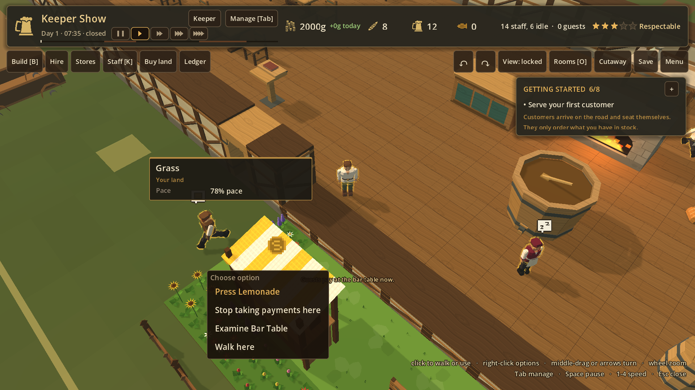

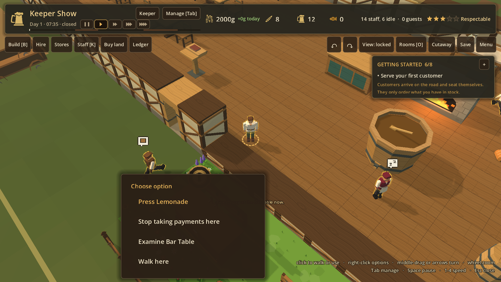

## Lighting and checks

Ambient light rises from .43–.70 to .48–.80 across night/day. This lifts
shadowed interiors and faces without adding lights or shadow passes, while
retaining the day/night cycle and warm hearth light.

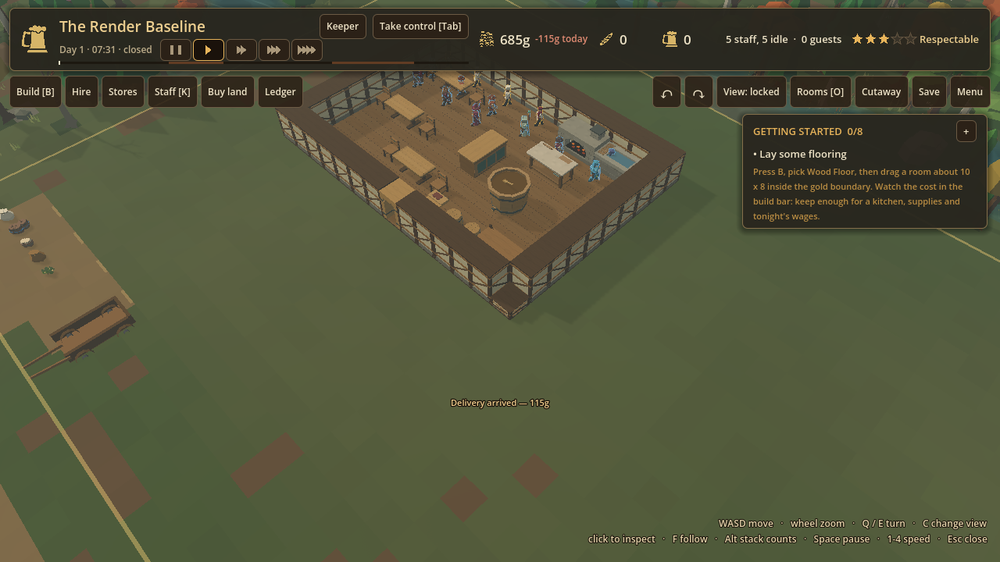

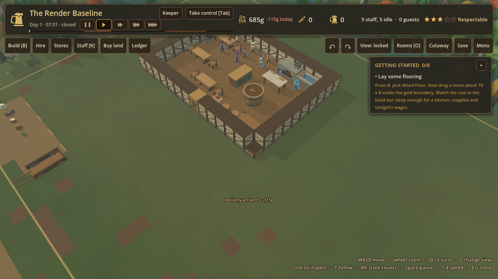

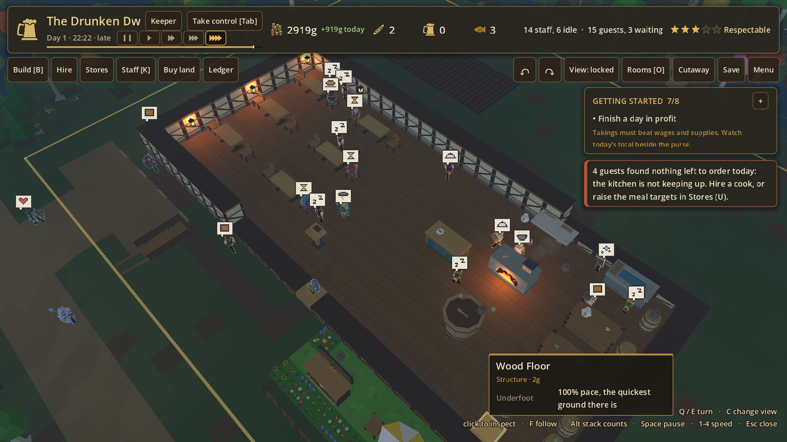

The requested `bash dev/run_tests.sh` passes all 23 suites, tutorial 70/70,
six-day tutorial soak, three chaos seeds, saves/resume and level completion.
After the final rod-fit and crowd-cache refinements the complete regression
suite passes again. Added checks live inside its existing garden and keeper
groups: real bar purchases debit exactly once across repeated rendered frames;
poses preserve both RNG streams and positions; rods clear on cancellation;
outfit changes preserve presentation attachments; four exact-overlap bodies
separate; the keeper marker faces upward. Long menus fit 1280x720, 1024x768,
1440x900 and portrait 720x1280 in headless and real-window runs, with their final
action reachable by scrolling/focus. This is not an on-device phone test.

The three-day sandbox still ends at **4,208g** with unchanged production totals:
bread 54, beer 72, water 27, fish 60, wheat 72. The actual walk-up purchase
regression separately checks consumption, ground stock and RNG. The five real
player save files retain their original SHA-256 hashes.

On the Arc 140V laptop, the frozen 1280x720 render profile at 30 people records
**1.621 → 1.611ms median**, **7.122 → 7.544ms p95**, and **318 → 318 draw calls**.
That fixture has no active work and measures rendering, not simulation or new
held props. A visible purchase or rod adds one mesh draw; the single keeper's
marker adds one. The live 1080p house at 5x records **17.0ms median, 38.3ms p95**
with 15 guests and 14 staff. It uses a different generated seed from earlier
live runs, so it is not a controlled performance comparison. The largest
tavern's 60fps target and phone measurements remain outstanding.

Evidence is in `.verification/visual_20261004/`; screenshots above are kept in
the repository so the commit's before/after comparison survives cleanup.

## Quieter character outlines — 2026-10-05

The staff/guest rim keeps its gold/blue distinction and the existing player
setting, but its extrusion is .012 instead of .032, with softer colours and
lower opacity. The previous thick shell exposed the faceted geometry as bright
wirework over sleeves and faces. The thinner rim lets clothing and the head
silhouette read more clearly, especially in keeper view.

The final fishing refinement also seats the rod at a dedicated right-palm
grip, following arm movement and body-build changes. Its orientation remains
aimed outward while the handle moves with the hand. A regression checks that
moving the arm actually moves the handle; the ordinary cargo point is unchanged.

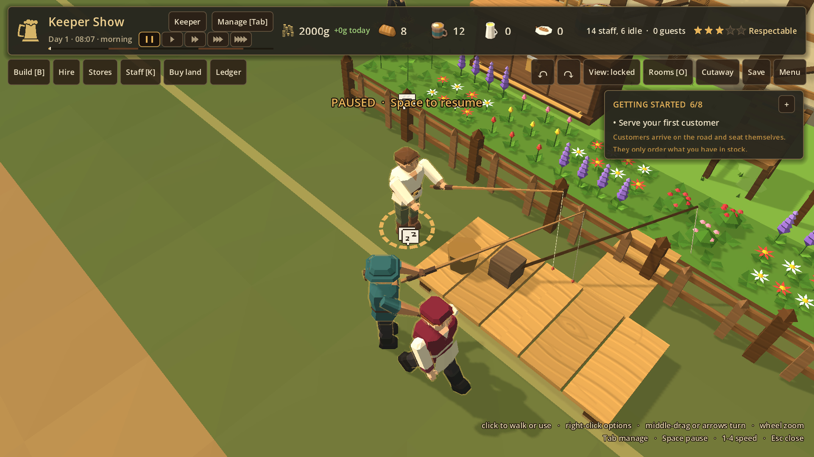

The complete run after the animated-palm refinement passes
`bash dev/run_tests.sh`: **23/23 suites, tutorial 70/70**, the same three chaos
fingerprints, the same 4,208g house and the same tutorial-soak totals. The runner
exits 0; its summary is `suites_host_final.txt` in the evidence directory below.
An earlier restricted run failed the three separate-process save/character/
uniform suites because their child engines reported denied log and certificate
access. Their restored-data checks passed. The complete rerun with normal host
access passes those engine-error checks without weakening or filtering them.
The final screenshot run used the restricted sandbox after two automatic
approval timeouts; Godot reported denied log rotation and root-certificate
access there, but completed all four captures with no GDScript errors. The
game's geometry or simulation did not cause those environment messages.
Final logs/captures are in `.verification/visual_20261005/`. The five player
save hashes remain unchanged. Later building changes being made concurrently
are outside this visual pass and are not covered by this completed run.
